# CRM Fondazione - Architettura del Sistema

Questo documento fornisce una panoramica completa dell'architettura del sistema CRM per la gestione di pazienti con dipendenze e gruppi di supporto psicologico, utilizzando diagrammi Mermaid JS.

## Architettura Completa del Sistema

```mermaid
graph TB
    %% Livello Utente
    User[👤 Operatori Fondazione]

    %% Livello Frontend
    Frontend[🌐 React Frontend<br/>Porta: 3005<br/>Material-UI]

    %% Livello API Gateway
    Gateway[🚪 API Gateway<br/>Porta: 3000<br/>Express + Proxy]

    %% Livello Microservizi
    AuthService[🔐 Servizio Auth<br/>Porta: 3001<br/>JWT + bcrypt]
    PatientService[👥 Servizio Pazienti<br/>Porta: 3002<br/>Upload documenti]
    ClinicalService[📊 Servizio Clinico<br/>Porta: 3003<br/>Cartelle + Visite]
    GroupService[🏥 Servizio Gruppi<br/>Porta: 3004<br/>Supporto Conduttorico]
    BillingService[💳 Servizio Fatturazione<br/>Porta: 3005<br/>Fatture + PDF]
    AuditService[📝 Servizio Audit<br/>Porta: 3006<br/>Logging + GDPR]

    %% Livello Database
    DB[(🗄️ PostgreSQL<br/>Porta: 5432<br/>fondazione_crm)]

    %% Schemi Database
    AuthSchema[(schema auth<br/>utenti, ruoli, sessioni)]
    PatientSchema[(schema patient<br/>pazienti, documenti, storico)]
    ClinicalSchema[(schema clinical<br/>cartelle, visite, note)]
    GroupSchema[(schema group<br/>gruppi supporto, membri)]
    BillingSchema[(schema billing<br/>fatture, pagamenti)]
    AuditSchema[(schema audit<br/>log, consensi GDPR)]

    %% Sistemi Esterni
    FileSystem[📁 File System<br/>Archiviazione Documenti]

    %% Interazioni Utente
    User --> Frontend

    %% Frontend to Gateway
    Frontend --> Gateway

    %% Routing Gateway
    Gateway -->|/auth/*| AuthService
    Gateway -->|/users/*| AuthService
    Gateway -->|/roles/*| AuthService
    Gateway -->|/patients/*| PatientService
    Gateway -->|/documents/*| PatientService
    Gateway -->|/clinical/*| ClinicalService
    Gateway -->|/groups/*| GroupService
    Gateway -->|/billing/*| BillingService
    Gateway -->|/audit/*| AuditService
    Gateway -->|/gdpr/*| AuditService

    %% Servizi al Database
    AuthService --> DB
    PatientService --> DB
    ClinicalService --> DB
    GroupService --> DB
    BillingService --> DB
    AuditService --> DB

    %% Schemi Database
    DB --> AuthSchema
    DB --> PatientSchema
    DB --> ClinicalSchema
    DB --> GroupSchema
    DB --> BillingSchema
    DB --> AuditSchema

    %% Operazioni File
    PatientService --> FileSystem
    ClinicalService --> FileSystem

    %% Styling
    classDef frontend fill:#e1f5fe,stroke:#0277bd,stroke-width:2px
    classDef gateway fill:#f3e5f5,stroke:#7b1fa2,stroke-width:2px
    classDef service fill:#e8f5e8,stroke:#2e7d32,stroke-width:2px
    classDef database fill:#fff3e0,stroke:#f57c00,stroke-width:2px
    classDef external fill:#fce4ec,stroke:#c2185b,stroke-width:2px

    class User,Frontend frontend
    class Gateway gateway
    class AuthService,PatientService,ClinicalService,GroupService,BillingService,AuditService service
    class DB,AuthSchema,PatientSchema,ClinicalSchema,GroupSchema,BillingSchema,AuditSchema database
    class FileSystem external
```



## Database Schema Relationships

```mermaid
erDiagram
    %% Auth Schema
    USERS ||--|| ROLES : appartiene_a
    USERS ||--o{ USER_SESSIONS : ha_sessioni
    USERS ||--o{ USER_PERMISSIONS : ha_permessi_personali

    %% Schema Pazienti
    USERS ||--o{ PATIENTS : creato_da
    USERS ||--o{ PATIENTS : medico_curante
    PATIENTS ||--o{ PATIENT_DOCUMENTS : ha_documenti
    PATIENTS ||--o{ PATIENT_HISTORY : ha_storico

    %% Schema Clinico
    PATIENTS ||--o{ CLINICAL_RECORDS : ha_cartelle
    USERS ||--o{ CLINICAL_RECORDS : creato_da
    CLINICAL_RECORDS ||--o{ CLINICAL_VISITS : ha_visite
    CLINICAL_RECORDS ||--o{ CLINICAL_DOCUMENTS : ha_documenti_clinici
    CLINICAL_RECORDS ||--o{ CLINICAL_NOTES : ha_note_cliniche

    %% Schema Gruppi Supporto
    GROUPS ||--o{ GROUP_MEMBERS : ha_membri
    PATIENTS ||--o{ GROUP_MEMBERS : partecipa_in
    USERS ||--o{ GROUP_MEMBERS : conduce
    USERS ||--o{ GROUPS : creato_da
    GROUPS ||--o{ GROUP_DOCUMENTS : ha_documenti_gruppo
    GROUPS ||--o{ GROUP_NOTES : ha_note_gruppo

    %% Schema Fatturazione
    PATIENTS ||--o{ INVOICES : ha_fatture
    USERS ||--o{ INVOICES : creato_da

    %% Schema Audit & GDPR
    USERS ||--o{ AUDIT_LOGS : esegue_azione
    PATIENTS ||--o{ GDPR_CONSENTS : ha_consensi
    PATIENTS ||--o{ DATA_REQUESTS : soggetto_di

    %% Definizioni Entità
    ROLES {
        int id PK
        string name "admin, Operatore, Medico, Conduttore"
        text description
        jsonb permissions "permessi granulari"
        timestamp created_at
        timestamp updated_at
    }

    USERS {
        int id PK
        string username UNIQUE
        string email UNIQUE
        string password_hash
        string first_name "nome"
        string last_name "cognome"
        int role_id FK
        jsonb user_permissions "sovrascrive permessi ruolo"
        timestamp last_login
        timestamp created_at
        timestamp updated_at
    }

    PATIENTS {
        int id PK
        string codice_fiscale UNIQUE "CF italiano"
        string numero_tessera_sanitaria UNIQUE "tessera SSN"
        string nome
        string cognome
        date data_nascita
        string luogo_nascita "comune italiano"
        char sesso "M/F"
        text indirizzo "via, civico"
        string citta "comune italiano"
        string cap "codice postale italiano"
        string provincia "sigla provincia italiana"
        string telefono "formato italiano"
        string email
        text anamnesi_medica
        text note
        int medico_curante FK "clinico di riferimento"
        string sostanza_abuso "sostanza primaria"
        text[] abusi_secondari "array sostanze secondarie"
        string professione
        string stato_civile "single, married, divorced, etc"
        boolean consenso_privacy "GDPR obbligatorio"
        boolean consenso_marketing "GDPR opzionale"
        int created_by FK
        timestamp created_at
        timestamp updated_at
    }

    CLINICAL_RECORDS {
        int id PK
        int patient_id FK
        string diagnosis "diagnosi clinica"
        text treatment_plan "piano terapeutico"
        text notes "note del clinico"
        int created_by FK
        timestamp created_at
        timestamp updated_at
    }

    GROUPS {
        int id PK
        string name "nome gruppo supporto"
        text description "descrizione gruppo"
        string frequency "frequenza incontri"
        int created_by FK
        timestamp created_at
        timestamp updated_at
    }

    GROUP_MEMBERS {
        int id PK
        int group_id FK
        int user_id FK "null per pazienti"
        int patient_id FK "null per conduttori "
        string member_type "patient o conductor"
        timestamp joined_at "data ingresso"
        timestamp left_at "data uscita"
    }

    INVOICES {
        int id PK
        int patient_id FK
        string invoice_number UNIQUE "numero fattura"
        decimal amount "importo in euro"
        text description "descrizione prestazione"
        string status "Da Pagare, Pagata"
        date issue_date "data emissione"
        date paid_date "data pagamento"
        int created_by FK
        timestamp created_at
        timestamp updated_at
    }
```

## Service Communication Flow


## Data Flow Architecture

```mermaid
graph TD
    %% Input Layer
    UserInput[👤 User Input]
    FileUpload[📁 File Upload]

    %% Presentation Layer
    ReactApp[⚛️ React Application]
    MaterialUI[🎨 Material-UI Components]

    %% State Management
    AuthContext[🔐 Auth Context]
    ApiService[🌐 API Service]

    %% Network Layer
    AxiosInterceptors[📡 Axios Interceptors]
    JWTHandler[🎫 JWT Handler]

    %% Gateway Layer
    APIGateway[🚪 API Gateway]
    CORS[🛡️ CORS Policy]
    Helmet[🔒 Security Headers]

    %% Business Logic
    AuthLogic[🔐 Authentication Logic]
    PatientLogic[👥 Patient Management]
    ClinicalLogic[📊 Clinical Records]
    GroupLogic[🏥 Group Management]
    BillingLogic[💳 Billing System]
    AuditLogic[📝 Audit & Compliance]

    %% Data Layer
    DatabaseORM[🗄️ Database Queries]
    FileStorage[📁 File System]

    %% Security Layer
    PermissionCheck[✅ Permission Validation]
    DataSanitization[🧼 Data Sanitization]
    InputValidation[🔍 Input Validation]

    %% Flow connections
    UserInput --> ReactApp
    FileUpload --> ReactApp
    ReactApp --> MaterialUI
    ReactApp --> AuthContext
    ReactApp --> ApiService

    ApiService --> AxiosInterceptors
    AxiosInterceptors --> JWTHandler
    AxiosInterceptors --> APIGateway

    APIGateway --> CORS
    APIGateway --> Helmet
    APIGateway --> AuthLogic
    APIGateway --> PatientLogic
    APIGateway --> ClinicalLogic
    APIGateway --> GroupLogic
    APIGateway --> BillingLogic
    APIGateway --> AuditLogic

    AuthLogic --> PermissionCheck
    PatientLogic --> PermissionCheck
    ClinicalLogic --> PermissionCheck
    GroupLogic --> PermissionCheck
    BillingLogic --> PermissionCheck

    PermissionCheck --> InputValidation
    InputValidation --> DataSanitization
    DataSanitization --> DatabaseORM

    PatientLogic --> FileStorage
    ClinicalLogic --> FileStorage

    DatabaseORM --> FileStorage

    %% Styling
    classDef input fill:#e3f2fd,stroke:#1976d2,stroke-width:2px
    classDef ui fill:#e8f5e8,stroke:#388e3c,stroke-width:2px
    classDef network fill:#fff3e0,stroke:#f57c00,stroke-width:2px
    classDef logic fill:#f3e5f5,stroke:#7b1fa2,stroke-width:2px
    classDef security fill:#ffebee,stroke:#d32f2f,stroke-width:2px
    classDef data fill:#fafafa,stroke:#616161,stroke-width:2px

    class UserInput,FileUpload input
    class ReactApp,MaterialUI,AuthContext,ApiService ui
    class AxiosInterceptors,JWTHandler,APIGateway,CORS,Helmet network
    class AuthLogic,PatientLogic,ClinicalLogic,GroupLogic,BillingLogic,AuditLogic logic
    class PermissionCheck,DataSanitization,InputValidation security
    class DatabaseORM,FileStorage data
```



## Technology Stack Overview


## Deployment Architecture


## Key Features & Capabilities

### 🔐 Autenticazione e Autorizzazione

- Autenticazione basata su JWT con refresh token
- Controllo accessi basato sui ruoli (RBAC) con permessi granulari
- Permessi utente possono sovrascrivere quelli del ruolo (modello ibrido)
- Protezione di route e endpoint API

### 👥 Gestione Pazienti

- Anagrafica completa pazienti con dati sanitari italiani
- Codice Fiscale e Tessera Sanitaria Nazionale
- Gestione documenti (caricamento, download, organizzazione)
- Assegnazione clinico di riferimento e storico medico
- Tracciamento sostanze di abuso primarie e secondarie
- Conformità GDPR con gestione consensi

### 📊 Cartelle Cliniche

- Cartelle cliniche digitali con tracciamento visite
- Note cliniche con timeline cronologica
- Allegati documentali per cartelle cliniche
- Sistema di pianificazione visite (in sviluppo futuro)

### 🏥 Gestione Gruppi di Supporto Conduttorico

- Creazione e gestione gruppi di supporto per dipendenze
- Assegnazione flessibile conduttori (qualsiasi operatore)
- Iscrizione pazienti e tracciamento partecipazione
- Documentazione e note di gruppo

### 💳 Sistema Fatturazione

- Generazione e gestione fatture per prestazioni
- Generazione PDF fatture con jsPDF
- Tracciamento stato pagamenti (Da Pagare/Pagata)
- Reportistica finanziaria e statistiche

### 📝 Audit e Conformità GDPR

- Logging completo delle azioni audit
- Strumenti di conformità GDPR per sanità italiana
- Gestione ritenzione dati
- Tracciamento attività utenti

### 🛡️ Funzionalità di Sicurezza

- Validazione e sanitizzazione input
- Prevenzione SQL injection
- Protezione XSS con Helmet.js
- Configurazione CORS per accesso API sicuro
- Restrizioni e validazione caricamento file

Questa architettura fornisce una base scalabile, sicura e manutenibile per le operazioni di gestione sanitaria di una fondazione italiana specializzata nel trattamento delle dipendenze.
